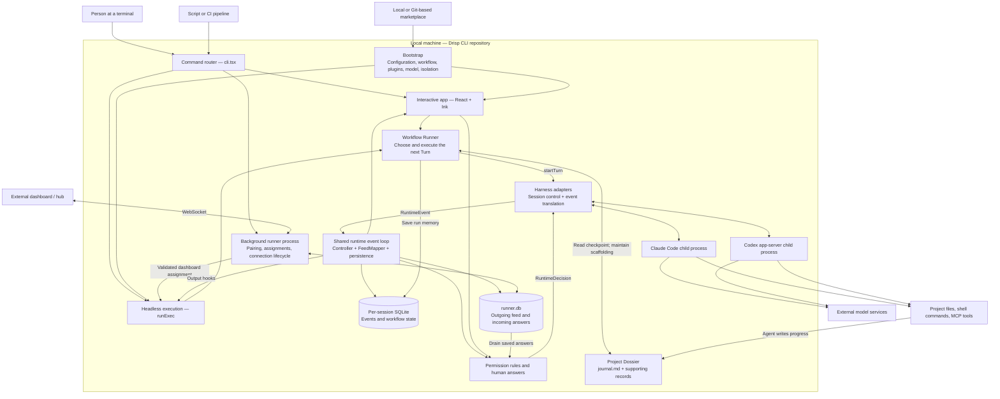
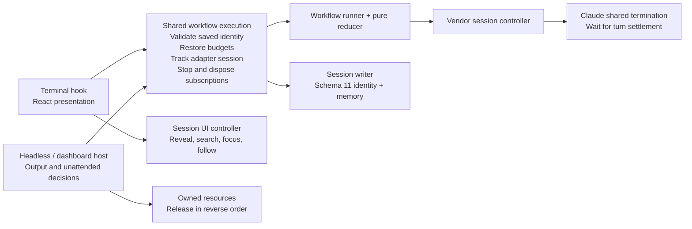
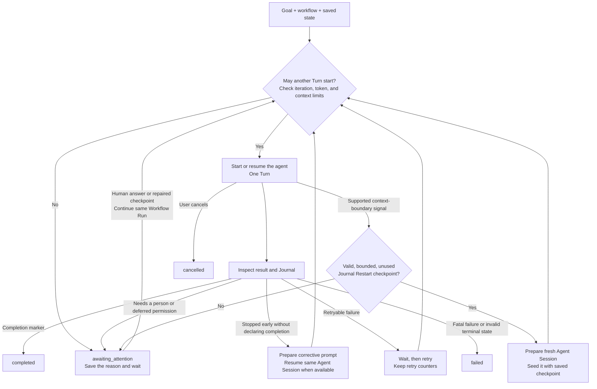
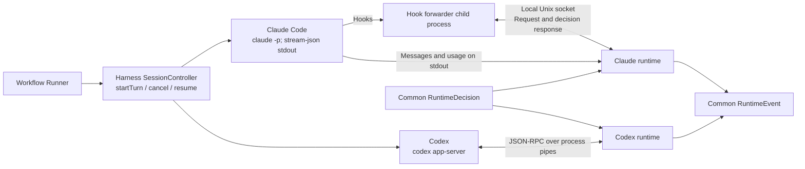
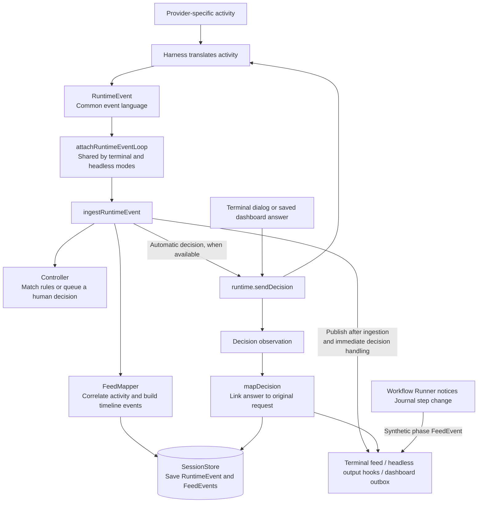
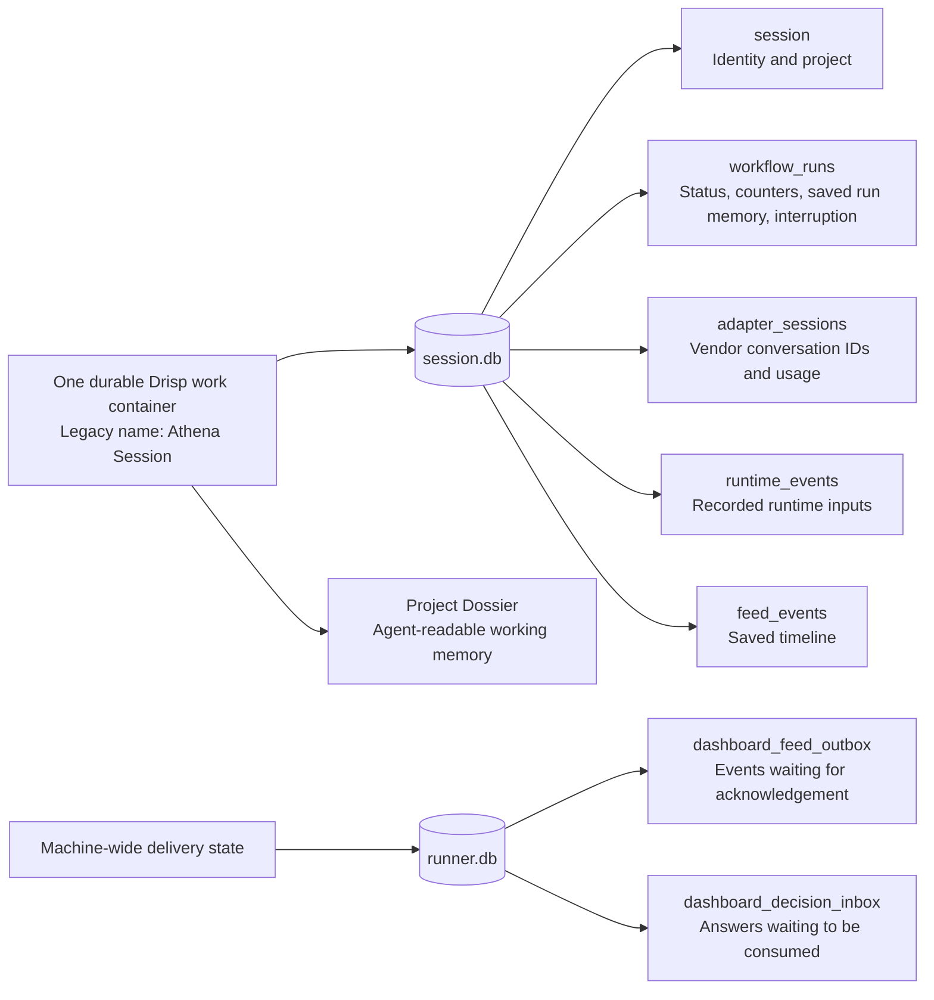
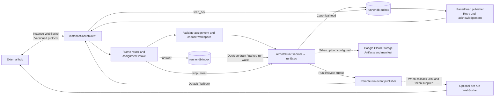
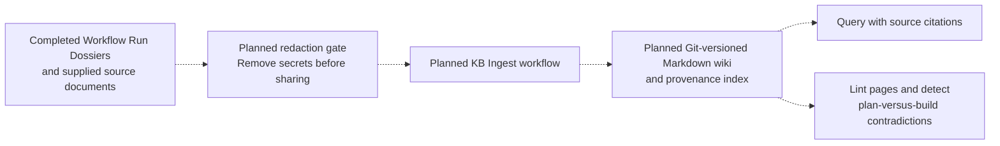

# Drisp architecture, explained in plain English

Updated 14 September 2026 for the maintainability branch after pulling Drisp 0.6.0 (`b0a143d`). This document describes the local implementation. See the [execution contract](execution-contract.md) for the mode matrix, continuation identity, failure policy, compatibility, and verification commands.

Drisp is a local program that supervises AI coding agents. You supply a goal and, optionally, a workflow. Drisp prepares the instructions and tools, starts Claude Code or Codex, follows what happens, handles decisions, saves progress, and decides whether more work is needed.

The agent does the reasoning and uses tools. Drisp supplies the surrounding execution rules and memory. A repeatable execution loop does not guarantee that the agent's answers or edits will be identical or correct.

**1. The overall system**

Boxes inside the local-machine boundary are implemented here. Most are modules inside a Node.js process, not separate servers. The terminal application and background runner are separate ways of hosting the shared execution code. Claude Code and Codex run as child processes. The dashboard, model services, and tool services are external.

There are three main entry paths:

| Entry path     | What it does                                                                                                                              | Main code                                                                                                                                                                            |
| -------------- | ----------------------------------------------------------------------------------------------------------------------------------------- | ------------------------------------------------------------------------------------------------------------------------------------------------------------------------------------ |
| `drisp`        | Opens a terminal interface with messages, tools, progress, and decision dialogs.                                                          | [cli.tsx](../src/app/entry/cli.tsx), [AppShell.tsx](../src/app/shell/AppShell.tsx)                                                                                                   |
| `drisp run`    | Executes without a terminal interface; produces text or JSONL, final-message files, and exit codes. JSONL means one JSON object per line. | [execCommand.ts](../src/app/entry/execCommand.ts), [runner.ts](../src/app/exec/runner.ts)                                                                                            |
| `drisp runner` | Keeps the machine connected to a dashboard and executes assignments using the headless path.                                              | [runnerProcess.ts](../src/app/runner/runnerProcess.ts), [runtimeDaemon.ts](../src/app/dashboard/runtimeDaemon.ts), [remoteRunExecutor.ts](../src/app/dashboard/remoteRunExecutor.ts) |

The background **Runner process** hosts work. The **Workflow Runner** is the reusable engine that drives one workflow. These are different things despite their similar names.

**2. Preparing a request**

[bootstrapConfig.ts](../src/app/bootstrap/bootstrapConfig.ts) brings together global settings, project settings, explicit overrides, the selected workflow, and the selected harness. Scalar settings generally favor explicit overrides over project settings over global defaults; plugins and additional directories have their own merge rules. Workflow settings also contribute defaults and execution configuration. [resolveExecutionSettings.ts](../src/app/bootstrap/resolveExecutionSettings.ts) owns the pure precedence rules; [executionAssets.ts](../src/app/bootstrap/executionAssets.ts) owns private temporary MCP files.

A workflow is a package of instructions and configuration: a prompt template, workflow instructions, optional loop settings, model preferences, isolation settings, and plugin dependencies. It is not a fully hard-coded graph of every action the agent will take. The runner enforces continuation and stopping rules; much of the actual work sequence is communicated to the agent through instructions.

[sessionPlan.ts](../src/core/workflows/sessionPlan.ts) composes the Turn Protocol and workflow instructions. It provides Claude with an appended system-prompt file and Codex with developer instructions. Generated prompt files are published atomically under `.athena/execution-assets/` with content-derived names, so preparing another session cannot truncate the active prompt. [plan.ts](../src/core/workflows/plan.ts) assembles resolved workflow/plugin information.

Plugins supply reusable skills, commands, agents, and MCP server configuration. MCP is the connection mechanism through which an agent can use tools offered by another program. [pluginRegistration.ts](../src/app/bootstrap/pluginRegistration.ts) registers commands and combines MCP configuration. A workflow plugin takes priority over a personal capability with the same name; duplicate MCP server names across plugins are rejected. Codex has a separate plugin-delivery path in [workflowPluginLifecycle.ts](../src/harnesses/codex/runtime/workflowPluginLifecycle.ts).

Marketplace resolution can use local files or cached Git repositories. Ordinary resolution clones a missing cache but does not pull an existing one; explicit refresh or upgrade operations update it. This keeps normal launches from silently fetching new workflow instructions. See [marketplaceRefresh.ts](../src/infra/plugins/marketplaceRefresh.ts).

**Shared execution responsibilities**

The common entry is [startWorkflowExecution.ts](../src/app/execution/startWorkflowExecution.ts). A resumed Run must match its saved instruction and capability digest. Changed settings produce a clear error instead of silently substituting a different workflow. A failed workflow checkpoint produces a failed outcome. The terminal keeps its runtime between prompts; headless execution closes its runtime after the request. That lifetime difference remains explicit.

**3. How the workflow keeps going**

This is a behavior diagram, not a verbatim list of internal states. Repeated nudges and retries also have limits and can require human attention.

The engine separates deciding from doing:

| Component                                                            | Simple explanation                                                                                                                                        |
| -------------------------------------------------------------------- | --------------------------------------------------------------------------------------------------------------------------------------------------------- |
| [runMachine.ts](../src/core/workflows/runMachine.ts)                 | The rulebook. Given the current state and an event, it computes the next state and required actions. It does not itself launch a process or write a file. |
| [workflowRunner.ts](../src/core/workflows/workflowRunner.ts)         | The executor of that rulebook. Starts Turns, reads and writes durable state, waits for retry delays, observes usage, and saves snapshots.                 |
| [terminalOutcome.ts](../src/core/workflows/terminalOutcome.ts)       | Interprets whether the Journal says finished, needs a human, or must continue.                                                                            |
| [continuationPolicy.ts](../src/core/workflows/continuationPolicy.ts) | Checks whether starting another Turn would violate configured resource limits.                                                                            |
| [restartContract.ts](../src/core/workflows/restartContract.ts)       | Reads and validates the small checkpoint needed to start a fresh Agent Session.                                                                           |

A successful agent process exit is not enough to complete a looped workflow. The Journal normally must end with `<!-- WORKFLOW_COMPLETE -->`. `<!-- NEEDS_HUMAN: reason -->` parks it for attention. A missing Journal or misplaced terminal marker can fail it. The runtime trusts a valid completion marker; it does not independently prove that the requested work is correct.

The Journal is a readable progress record, normally `<project>/.athena/<sessionId>/journal.md`. Larger work can move detailed unit records into `units/*.md` and keep shared context in `orientation.md`. Together these files are the **Dossier**.

The current restart design uses a bounded `## Restart` section in the Journal. It names the Workflow Run and records the objective, next action, constraints, changes, open questions, and references. The default checkpoint allowance is 2,000 estimated tokens. Admission also reserves an estimated 8,000 tokens for work when checking fresh-start context feasibility. Invalid or already-used checkpoints cause a pause instead of a blind restart.

This replaces the earlier fork-and-summarize handoff design. Automatic context-boundary restart is currently wired through Claude's headless `compact.pre` path; equivalent behavior should not be assumed for every harness and execution mode. Token enforcement observes reported usage, so cancellation delays or unreported work can exceed a configured budget. A human wake does not reset lifetime usage or iteration counters.

When loops are disabled, the same execution machinery can run a single Turn without the Journal-driven repeat cycle.

**4. Claude and Codex plug into the same boundary**

An adapter is a translator: Claude and Codex speak different protocols, but Drisp's central code wants the same concepts such as “tool started,” “permission requested,” and “agent finished.”

Claude receives process arguments and generated hook settings. Its hooks invoke a small forwarder that contacts Drisp through a local socket. The adapter also reads streamed stdout for messages and usage. Codex is started as `codex app-server`, then communicates over its standard input/output pipes using JSON-RPC requests, responses, and notifications.

The common contract is [Runtime](../src/core/runtime/types.ts); selectable adapters are in [registry.ts](../src/harnesses/registry.ts). Claude and Codex are enabled. OpenCode is a disabled placeholder, not a third working integration.

Isolation presets shape harness configuration and permissions. They are not evidence that Drisp creates a virtual machine or container around every request. The harness executes tools against the chosen working directory.

**5. How activity becomes a timeline, and answers go back**

A **RuntimeEvent** describes activity in the common language. A **FeedEvent** is prepared for the timeline. One RuntimeEvent may produce several FeedEvents or none. Headless JSONL also includes runtime and workflow lifecycle output; it is not simply a dump of FeedEvents.

The FeedMapper remembers six things: Feed Run boundaries and counters; which tool results belong to which calls; which answers belong to which requests; partially streamed messages; the root plan; and the identities of subagents. These are implemented in [mapper.ts](../src/core/feed/mapper.ts) and [feed/internals](../src/core/feed/internals).

The shared event loop prevents interactive and headless modes from independently implementing the same subscribe → ingest → decide → publish sequence. See [runtimeEventLoop.ts](../src/app/runtime/runtimeEventLoop.ts) and [ingest.ts](../src/core/feed/ingest.ts). The workflow's `phase` event is a special case: the Runner produces it directly from Journal step changes, outside normal RuntimeEvent mapping.

Rules can approve or deny matching requests. The terminal can show a permission or question dialog. Dashboard answers enter a durable inbox and are forwarded to the runtime. In an unattended workflow, an unanswered permission can be held briefly, then deferred and saved while the workflow parks. On continuation, a stored answer can be replayed against the matching reissued call. Autonomous execution supplies an allow policy within its granted tool surface, while workflow ask rules still require a person. See [rules.ts](../src/core/controller/rules.ts), [runner.ts](../src/app/exec/runner.ts), and [permissionHold.ts](../src/app/exec/permissionHold.ts).

The terminal is React rendered through Ink. Feed events become indexed timeline rows, filtered panels, and detail views. The default feed renderer uses Ink; an optional incremental renderer updates changed terminal lines directly. See [FeedSurface.tsx](../src/ui/components/FeedSurface.tsx).

**6. What is saved, and why there are different stores**

| Location                                                                       | Purpose                                                                  |
| ------------------------------------------------------------------------------ | ------------------------------------------------------------------------ |
| `~/.config/athena/config.json`                                                 | Global configuration. The old directory name remains.                    |
| `<project>/.athena/config.json`                                                | Project configuration.                                                   |
| `~/.config/athena/sessions/<id>/session.db`                                    | Durable work history and execution snapshots; current schema version 11. |
| `<project>/.athena/<id>/journal.md` and supporting files                       | Readable memory the agent can use after its conversation is replaced.    |
| `~/.local/state/drisp/runner.db` by default                                    | Shared machine delivery queues; current schema version 1.                |
| `runner.pid`, `runner.status.json`, `runner.log` in the runner state directory | Process identity/lock, recent status snapshot, and diagnostic log.       |

SQLite uses WAL mode, allowing the runner and local execution processes to open the same delivery database. Schema ownership and migrations are explicit in [schema.ts](../src/infra/sessions/schema.ts), [runnerDb.ts](../src/app/runner/runnerDb.ts), and [openVersionedDb.ts](../src/infra/db/openVersionedDb.ts).

On resume, stored information restores the timeline and mapper state; saved vendor IDs enable conversation continuation; saved workflow memory restores execution counters and limits. These are complementary kinds of recovery. The database records execution, while the Dossier carries the agent's explanation of its work. Neither automatically rolls back a shell command or file edit that already happened.

If event persistence fails, ingestion marks the store degraded and can still publish activity. A live display therefore does not by itself prove that all activity was saved. Delivery queues retry unacknowledged events; they should not be described as guaranteeing that external tool side effects happen exactly once.

The naming distinction matters:

| Term           | Meaning                                                                                      |
| -------------- | -------------------------------------------------------------------------------------------- |
| Athena Session | Legacy name for the durable Drisp container represented by one session database.             |
| Workflow Run   | One execution of a workflow, potentially spanning many Turns.                                |
| Turn           | One agent execution of a prompt. It can start fresh or resume existing conversation context. |
| Agent Session  | Claude's conversation or Codex's thread. Multiple Turns can share it.                        |
| Feed Run       | A grouping used by the activity timeline, bounded by prompt identity when available.         |

`feed_events.run_id` is **not** `workflow_runs.id`. A Feed Run is an observation grouping, not the workflow's controlling state. There is no dedicated Turn table in the current session schema.

**7. The dashboard connection and recovery path**

The runner owns the dashboard connection and attachment mirror. An attachment means the dashboard has associated this local instance with a dashboard runner. Incoming assignments are validated before execution. Explicit project directories must be valid directories; otherwise the resolver creates a machine-local workspace scoped to the dashboard and run or session. The resolver itself does not clone a repository. See [remoteWorkspaceResolver.ts](../src/app/dashboard/remoteWorkspaceResolver.ts).

[packages/protocol](../packages/protocol/README.md) defines the shared message contract using Zod schemas, TypeScript types, and generated JSON Schema. Messages include starting work, stopping it, sending a steer, answering a request, reporting events, and asking for human attention. Old message names are normalized to canonical names, and the connection negotiates which naming convention to send. The package is bundled into the CLI; it is not another running service.

A steer is a new human instruction queued for the next Turn boundary. It does not rewrite a Turn already in progress. A parked workflow can be woken through the headless continuation path or dashboard handling, restoring the existing Workflow Run when available.

The outbox and inbox survive process restarts. The runner's recent-run list is different: it is an in-memory recent history reflected in the status file, not a separate durable run-history table. The per-session databases retain Workflow Run state.

**Supported delivery paths:** The [execution contract](execution-contract.md#compatibility-and-delivery) supplements ADR 0017's original instance-socket-only statement. [remoteRunEventPublisher.ts](../src/app/dashboard/remoteRunEventPublisher.ts) still chooses a separate callback socket when a callback URL and token are supplied, and falls back to the instance socket if connection setup fails. The diagram shows this code path explicitly. [artifactCapture.ts](../src/app/dashboard/artifactCapture.ts) also supports configured artifact uploads to Google Cloud Storage. The external hub and storage service implementations are outside this repository.

Optional product telemetry is another external connection: [telemetry/client.ts](../src/infra/telemetry/client.ts) uses PostHog when the build contains a key and telemetry is enabled. It is separate from workflow execution and the dashboard feed.

**8. The knowledge base is a documented extension**

All arrows here are dashed because this is documented design, not implemented application wiring found in this checkout. [KNOWLEDGE_BASE.md](../KNOWLEDGE_BASE.md) and ADRs 0010–0013 describe Ingest, Query, and Lint running through the existing workflow engine. The intended benefit is memory shared across many completed work containers, with every claim linked to its source.

No KB command, KB storage module, or redaction implementation was found in the application source inspected. It should not appear as a live subsystem in a diagram of today's code. The KB glossary also still mentions a Handoff chain, while the current restart implementation and ADR 0019 have moved to a bounded Journal checkpoint.

**9. A concrete example**

Suppose you ask a looped workflow to fix a bug and verify the fix:

1. The CLI reads configuration and resolves the workflow, model, tools, and permissions.
2. The Workflow Runner prepares the first Turn and Journal location.
3. The selected adapter starts Claude or Codex with the composed instructions.
4. The agent reads files, edits code, and runs checks. Its tool activity becomes RuntimeEvents, then timeline FeedEvents and saved history.
5. If a tool needs approval, a rule or person answers. An unattended request that needs a person can park the workflow with its question saved.
6. The agent updates the Journal with findings, completed work, and the next action.
7. After the Turn, the runner reads the result and Journal. It continues after an early stop, retries a transient failure, or completes when the final completion marker is present.
8. If conversation context must be replaced on a supported path, the validated Restart checkpoint seeds a fresh Agent Session. If the checkpoint is unsafe to reuse or too large, the workflow waits for attention.
9. The terminal, JSONL output, or dashboard shows the outcome. The session database and Dossier provide the state needed for later inspection or continuation.

**10. Code map and architectural observations**

| Directory                                            | Responsibility                                                            |
| ---------------------------------------------------- | ------------------------------------------------------------------------- |
| `src/app/entry`                                      | Parse commands and choose how to run.                                     |
| `src/app/bootstrap`                                  | Assemble configuration and dependencies.                                  |
| `src/app/exec`, `src/app/shell`, `src/app/providers` | Host shared behavior in headless or interactive mode.                     |
| `src/core/workflows`                                 | Workflow control, Journal interpretation, restart and continuation rules. |
| `src/core/runtime`, `src/core/controller`            | Common activity/decision contracts and decision logic.                    |
| `src/core/feed`                                      | Turn activity into correlated, displayable history.                       |
| `src/harnesses`                                      | Claude/Codex process control and protocol translation.                    |
| `src/infra`                                          | SQLite, configuration, plugins, process support, telemetry.               |
| `src/ui`, `src/setup`                                | Terminal display, input handling, and setup wizard.                       |
| `src/app/runner`, `src/app/dashboard`                | Background process, delivery queues, dashboard coordination.              |
| `packages/protocol`                                  | Shared dashboard message definitions and compatibility conversions.       |

The strongest separation is between workflow control, activity projection, and vendor adapters. The shared event loop and pure run-state transition function reduce duplicated behavior and make important rules testable without a real agent.

This is a practical modular application, not a perfectly enforced layering scheme: some infrastructure imports application command registration, and large orchestration files still bring many concerns together. The dashboard path also retains compatibility transports and names. Those details explain why the real code is more involved than the top-level diagram.

The central limitation is that the agent still owns semantic correctness. Drisp can check a checkpoint's shape, retain counters, correlate events, retry delivery, and enforce stopping rules. A completion marker or a changed Journal is not independent evidence that a bug is fixed. Workflow instructions and actual verification work still matter.

The repository contains Vitest unit/integration tests and sentinel tests for replay equivalence, ordering, duplicate decisions, degraded persistence, and resume behavior. They provide behavior evidence for the implementation. The cleanup is checked using the contributor commands in the execution contract; fake vendors and hubs do not substitute for a live deployment test.
