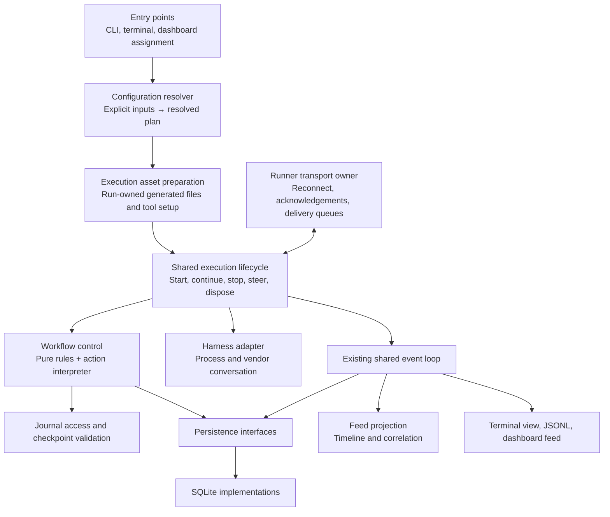
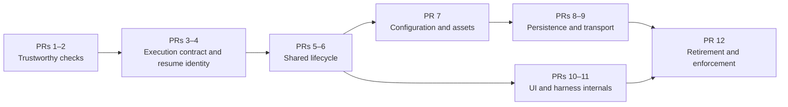

# Drisp maintainability and predictability cleanup plan

Proposed 13 September 2026; implementation continued 14 September after pulling Drisp 0.6.0. The phase descriptions below preserve the original proposal. Current behavior and explicit scope decisions are recorded in the [execution contract](execution-contract.md), and the [architecture diagram](drisp-architecture.md) reflects the changed paths.

## Implementation record — 14 September 2026

Implemented on `codex/maintainability-cleanup` after merging current main (`b0a143d`).

| Review area                    | Implemented result                                                                                                                                                                     |
| ------------------------------ | -------------------------------------------------------------------------------------------------------------------------------------------------------------------------------------- |
| Discovery and architecture     | Explicit test scope; resolved static/dynamic/type imports; layer rules; producer exceptions; negative and empty-input fixtures; sequence-order behavior test.                          |
| Quality gates                  | Incremental test typing, CI dead-code check, built CLI/runner/forwarder/protocol smoke checks.                                                                                         |
| Execution contract             | Mode/harness matrix, structured terminal and headless outcomes, visible unsupported context restart.                                                                                   |
| Continuation identity          | Schema 11; select parked workflow before bootstrap; hash settings/instructions/plugins; retain original identity and budgets; warn on historical records.                              |
| Shared execution               | Common admission/restoration, adapter observation, abort observation, stop/dispose contract; owned reverse-order cleanup in headless mode; terminal cancellation waits for settlement. |
| Configuration and assets       | Pure precedence resolver with provenance; app-owned atomic plugin registration; private MCP files and cleanup; immutable, atomically published prompt assets.                          |
| Persistence                    | Workflow-owned snapshot types; failed checkpoint stops execution; migration failures close handles; SQLite identity/migration and wake tests.                                          |
| Delivery                       | Retain protocol edge normalization; close failed callback candidates; clear connect/drain timers; idempotent publisher close; delivery/compatibility inventory.                        |
| Terminal and harness internals | Intent-based UI controller; React workflow glue moved to app; one Claude child-termination policy; explicit harness restart capability.                                                |
| Documentation and retirement   | Updated architecture diagrams, context map, README, ADR supplement, compatibility removal conditions; obsolete lint rules and moved-path exports removed.                              |

The lifecycle extraction is scoped to a **Workflow Run**. Host lifetimes remain deliberately different: the terminal's runtime and writer span several prompts, whereas a headless request owns and closes them. Combining those lifetimes would reintroduce the documented bug where changing a runtime closes a still-active writer. The existing shared runtime event loop remains the single event-processing implementation; this cleanup does not replace it with a second engine.

The harness refactor follows observed duplicated cancellation behavior rather than performing the proposed directory-count consolidation. Managed checkpoint restart remains headless-Claude-only and is visible in the mode matrix; it is not silently claimed as terminal/Codex parity. Legacy wire removal remains dependent on #186 and the hub rollout. Persistent Athena paths are retained, as the plan requires.

Validation: **289 test files / 3,708 tests pass**. Production, protocol, and the selected test TypeScript checks pass. Formatting, ESLint, Knip, the CLI build, and package smoke checks pass. ESLint retains five existing warnings in unrelated files. Local runtime: Node 24; CI retains Node 20 and 22. No paid agent or deployed hub was invoked for these checks.

**Outcome**

A maintainer should be able to answer five questions quickly: where is this behavior decided, who owns its state, which inputs affect it, what happens when it fails, and which test proves it?

Prioritize trustworthy checks, stable execution behavior, and clear ownership. File moves and renaming come later. Preserve the useful existing design: the pure workflow state reducer, the shared runtime event loop, harness adapters, and explicit SQLite schema owners.

## Evidence and priorities

| Priority | Evidence in the planning checkout                                              | Response                                                                  |
| -------- | ------------------------------------------------------------------------------ | ------------------------------------------------------------------------- |
| P0       | Architecture checks searched deleted source paths and masked command failures. | Resolve current source imports and reject missing/empty scans.            |
| P0       | Vitest discovered tests inside nested checkouts.                               | Explicit application/package discovery.                                   |
| P1       | Terminal workflow execution omitted saved memory and structured outcomes.      | Share admission/restoration, surface outcomes, document mode differences. |
| P1       | Wake could select the currently active workflow.                               | Select the parked workflow and validate saved execution identity.         |
| P1       | Generated prompts and MCP paths were shared between preparations.              | Content-addressed prompts and privately owned temporary MCP assets.       |
| P2       | Infrastructure imported app registration; workflow control imported React.     | Move composition and UI glue to app; enforce dependencies.                |
| P2       | Documentation described retired flags and incomplete delivery paths.           | Current execution contract and compatibility inventory.                   |

Measured source sizes identify places to inspect, not arbitrary limits: `AppShell.tsx` 2,381 lines; `runnerCommand.ts` 1,871; `runMachine.ts` 1,429; `workflowRunner.ts` 1,156; `app/exec/runner.ts` 1,100; `useFeed.ts` 703. A large, cohesive reducer may be easier to maintain than many small files with hidden ordering requirements.

The test command above passed 12 tests across six copies. This is evidence of incorrect discovery, not evidence that the application is fully healthy. No full-suite baseline has been established in this planning pass.

## Proposed ownership model



This proposes one shared execution module, not a new framework or global service container. It owns the ordering and cleanup currently repeated by execution modes. Workflow control and feed projection remain separate owners. The diagram represents responsibility, not a requirement for one file per box.

## Phase 0 — Make the checks trustworthy

**PR 1: Repair test discovery and architecture checks.**

- Restrict Vitest collection to the current application and protocol package; exclude generated output and nested checkout locations. Audit ESLint, Prettier, TypeScript, and Knip scope too rather than assuming every tool discovers files the same way.
- Replace shell pipelines in the architecture tests with a source-aware check using the existing TypeScript tooling or an appropriately scoped lint rule. Missing input directories and an empty scanned file set must fail clearly.
- Update the invariant itself: FeedEvents have intentional producers beyond the mapper, including synthetic workflow phase events. Express approved ownership rather than reviving the obsolete “only mapper constructs events” claim.
- Add small negative fixtures: an illegal import or unauthorized event producer must make the check fail. Add a nested-worktree fixture proving it is excluded from discovery.
- Remove lint rules applying only to deleted gateway/channel trees. Ensure later ESLint overrides retain common restrictions where intended.

**Done when:** the same command selects the same intended files regardless of nested worktrees; a deliberately introduced violation fails; an empty scan cannot pass.

**PR 2: Establish a useful quality baseline.**

- Record baseline lint, typecheck, test, build, and dead-code results against the settled continuation changes. Separate existing failures from regressions.
- Add test TypeScript checking incrementally: the current root `tsconfig.json` excludes tests, so production typechecking does not validate test contracts. Avoid fixing every historical test typing issue in the first PR.
- Reconcile Knip entry discovery with the actual bundled entries, including the detached runner. Confirm how its build integration discovers entries before adding redundant configuration.
- Run dead-code checking in CI once its baseline is reliable; it currently runs during prepublish but not in the main CI workflow.
- Preserve the existing runtime matrix. Add package-level smoke checks for the built CLI and protocol exports, without invoking real paid agents.

**Done when:** contributors have a short documented verification command, failures have owners, and CI checks the code that will actually ship. Do not silence findings through broad exclusions.

## Phase 1 — Define predictable continuation and outcomes

**PR 3: Write and test the execution contract.**

Create a compact behavior matrix for interactive, headless, and dashboard execution across both supported harnesses. Cover fresh start, normal completion, premature stop/nudge, retry, deferred decision, parked-run wake, cancellation, timeout, usage exhaustion, and supported context restart.

For every cell, say either “supported with this outcome” or “unsupported with this visible behavior.” Identical presentation is unnecessary; shared business rules and explicit differences are necessary. Define `completed`, `awaiting_attention`, `failed`, and `cancelled` as distinct outcomes all the way to presentation. A completed function or zero process exit code must not silently mean completed work.

Reconcile ADRs 0014, 0016, and 0019 with the current code first. Do not extract the retired fork/summarize handoff behavior into a new abstraction.

**Done when:** the matrix is backed by behavior tests through fake harness adapters, and any remaining mode differences are intentional and visible. Reuse #168 rather than opening another issue describing the same problem.

**PR 4: Pin continuation inputs.**

Address #165 by making the resumed Workflow Run carry its resolved workflow identity and execution requirements. A name alone is insufficient if the installed workflow has changed. Define which information must be saved: source/version or content identity, instructions, Journal location and markers, loop limits, harness/model selection, and plugin references. Do not persist authentication tokens or entire environment snapshots.

Distinguish stable execution semantics from refreshable credentials and endpoint settings. Decide explicitly what happens when an old workflow or plugin version is unavailable: require an explicit migration/new run or report why continuation cannot proceed. Do not silently substitute current defaults. Human wake must retain counters and budgets.

Use an additive versioned storage change if required. Existing sessions without the new information need a documented fallback that reports reduced reproducibility. Keep old data readable; this phase does not rename database files or tables. Handle explicit workflow overrides as an intentional operation with visible consequences, not an accidental merge.

**Done when:** changing the project's active workflow after parking cannot silently alter the resumed workflow; old sessions still produce a clear result. Revisit CLI parsing issue #166 in this same behavior area, in a separate small fix if still reproducible.

## Phase 2 — Give execution one lifecycle owner

**PR 5: Extract shared execution assembly from headless mode.**

Introduce a non-React execution module under `src/app/` that owns the active runtime, harness session controller, Workflow Runner, event subscriptions, decision drain, cancellation signal, and cleanup. Keep the existing runtime event loop as its reusable internal module.

Sketch of the intended interface, to refine against actual callers:

```ts
const execution = startExecution(resolvedRequest, dependencies);
execution.subscribe(observer); // status, progress, decisions, usage
execution.steer(message);
await execution.stop(reason);
const outcome = await execution.result;
await execution.dispose();
```

The interface must explain how observers receive initial state without missing startup events, whether stopping waits for the child process, and whether disposal is idempotent. Avoid a large options object exposing every internal callback. Group dependencies by real owner: harness, persistence, decision input, clock/timers, and output observer.

Migrate the headless caller first without changing documented behavior. Keep text/JSONL formatting and exit-code mapping in its presentation adapter. Inject clocks and IDs where timing or identity affects behavior; retain real-process tests for signal handling and cleanup.

**Done when:** repeated start/stop and failed startup release owned timers, subscriptions, processes, and DB handles; cancellation has one settlement path; headless output remains contract-compatible.

**PR 6: Move interactive execution onto the same module.**

Move `useWorkflowSessionController`'s React coordination into the application layer and make it observe the shared execution lifecycle. Wire supported resume identity, saved workflow memory, suspension reasons, and cancellation through that lifecycle. Preserve structured outcomes rather than converting every non-failure to success.

Interactive-only concerns remain in React: focus, input editing, dialogs, terminal sizing, and rendering. Dashboard transport lifecycle remains with the runner transport owner, not with individual executions.

**Done when:** the Phase 1 matrix exercises both modes through their actual adapters; parked work is visible and actionable in the terminal; the old duplicated lifecycle assembly is deleted. Any unsupported context-boundary signal is explicitly documented and surfaced where relevant.

## Phase 3 — Resolve configuration once and own generated assets

**PR 7: Separate configuration resolution from side effects.**

Split current bootstrap into three meaningful steps: acquire required source data/cache entries, resolve a validated execution plan from explicit inputs, and materialize its assets. The pure resolver should not register global commands, spawn Git, or write prompt/MCP files.

Give precedence a single table, with behavior tests for global/project/CLI/workflow values, empty values, list merging, and plugin collisions. Include provenance in diagnostic output: “this model came from the project config.” Redact secrets in that output.

Write composed prompts and MCP configuration into a run-owned asset location. A process-ID-only filename is not sufficient if one process hosts several executions. Test two runs with different session IDs and workflow variables; preparing one must not rewrite the other's prompt. Decide retention for durable versus temporary assets so restart references remain valid.

Have plugin loading return definitions; let app composition register them in an appropriately owned command registry. Inspect the current module-global registry for state leaking between executions before choosing its replacement scope.

**Done when:** the same explicit inputs resolve to the same plan; resolution alone performs no writes/network calls; concurrent preparation does not overwrite another execution's assets; command registration does not leak across session resets.

## Phase 4 — Make persistence, failures, and delivery explicit

**PR 8: Clarify durable state and failure policy.**

- Put workflow-owned snapshot contracts with workflow control rather than importing their meaning from SQLite infrastructure. Keep raw database row types inside storage.
- Preserve the single schema owner for each database and distinguish per-session writer ownership from the shared-open delivery database. Test actual SQLite behavior; do not replace migration and locking tests with mocks.
- Classify failures by consequence: invalid input, unavailable harness, retryable execution failure, human attention, resource limit, persistence failure, and transport failure. Presentation maps these to messages and exit codes in one place per output format.
- Audit swallowed exceptions by purpose. Best-effort UI projection may continue; lost resumable workflow state must produce an explicit degraded outcome or stop policy. Decide that policy before changing behavior. Do not turn every catch into a fatal error.
- Verify replay, duplicate decisions, ordering, migration, interrupted writes, and resume counters through public behavior.

**Done when:** callers can tell whether displayed progress is durable; failures do not masquerade as success; retries cannot replenish a lifetime budget; storage migrations preserve historical sessions.

**PR 9: Centralize dashboard transport compatibility.**

Keep connection lifecycle, reconnect timers, acknowledgements, and outbox/inbox ownership in one transport module. Executions receive a feed sink and incoming commands, not the whole socket client. Preserve and deepen the existing narrow `FeedSink` design.

Normalize legacy frames once at the transport edge. Document delivery guarantees separately for durable feed events, compatibility run events, answers, stop/steer commands, and artifacts. A durable feed outbox does not make external tool side effects exactly-once.

Decide whether the optional callback socket is supported or retired. This requires reconciling ADR 0017 with actual hub usage, not deleting the path because the docs omit it. Keep legacy frame removal tied to #186 and the hub rollout dependency. Do not remove old names ahead of that agreement.

**Done when:** fake-hub tests cover the retained transports, acknowledgements, duplicates, reconnects, and restart recovery; the documentation describes the same paths as the implementation.

## Phase 5 — Simplify the terminal and vendor internals

**PR 10: Reduce the shell's interface.**

Build on #8: expose meaningful UI operations such as revealing an event, submitting a search, changing focus, or following the latest output. Keep reducer actions and coupled cursor/viewport updates private.

Do not translate each action into an equally broad public method list and call it simplification. The leverage comes from callers no longer coordinating cursor, viewport, focus, and follow mode themselves. Separate execution observation, keyboard intents, and view composition inside `AppShell.tsx` after the shared lifecycle is in place.

**Done when:** a caller requests a user intent in one operation; tests assert visible focus/scroll/search behavior rather than copying reducer assignments; existing feed ordering and rendering performance stay within the measured baseline.

**PR 11: Deepen harness internals where changes currently scatter.**

Use the existing harness interface and shared contract tests. Inspect lifecycle and translation changes across Claude/Codex before reorganizing directories. Candidate internal ownership: process/conversation lifecycle, protocol translation, and launch configuration/assets. Keep provider-specific behavior private while reporting supported capabilities explicitly.

#10's proposed eight-to-three directory consolidation is a starting hypothesis, not the acceptance criterion. Generated Codex protocol bindings stay generated. Move diagnostics and live-test support only after checking whether they are runtime dependencies or developer support; a large file is not proof it belongs elsewhere.

**Done when:** changing one vendor's event mapping or cancellation behavior has a clear owner; callers need no vendor-specific exceptions; contract tests cover partial output, approval correlation, usage accounting, interruption, and cleanup.

## Phase 6 — Finish the migration and remove obsolete paths

**PR 12: Retire compatibility deliberately and enforce the new structure.**

- Reconcile README commands, exit codes, continuation comments, current ADRs, the context map, and the architecture document. Clearly label planned KB work and historical designs.
- Record each compatibility path's consumers, removal condition, and release dependency: old CLI names, wire names, tracker filename, and retired continuation settings. Keep #186 blocked until its hub dependency is met.
- Remove proven dead wrappers, obsolete generated assets, and retired code paths with their dead tests. Preserve meaningful regression coverage at the replacement interface.
- Add resolved-import checks for the final ownership rules. App composes dependencies; workflow decisions do not import React; harness internals are accessed through supported interfaces. Use a small explicit list for remaining justified exceptions.
- Do not combine an Athena-to-Drisp disk-path migration with structural cleanup. If later required, make it a separately tested data migration.

**Done when:** documented entry points and implementation agree, internal callers do not depend on compatibility names, and architecture checks prevent the old coupling from returning.

## Order, review units, and risk



These are review units, not a promise of exactly twelve PRs. Split a unit when it mixes a behavior fix with a structural move. Each extraction migrates a real caller and removes the replaced path; avoid leaving two indefinite execution engines. Storage changes require additive migrations and old-data fixtures. Wire changes require compatibility verification against the external hub.

The highest-risk work is continuation identity and shared lifecycle ownership, followed by persistence and transport changes. UI intent cleanup and source moves become safer after those contracts are stable. Estimate effort after Phase 0 and the behavior matrix; current uncommitted continuation work makes a calendar estimate misleading.

## Existing work to reuse or reconsider

| Existing issue                                                                            | Relationship to this plan                                                                                                                                                                                                                                                         |
| ----------------------------------------------------------------------------------------- | --------------------------------------------------------------------------------------------------------------------------------------------------------------------------------------------------------------------------------------------------------------------------------- |
| [#168 — interactive lifecycle gaps](https://github.com/drisplabs/cli/issues/168)          | Primary input to execution parity; reconcile outdated fork/channel details with ADR 0019.                                                                                                                                                                                         |
| [#165 — workflow identity on wake](https://github.com/drisplabs/cli/issues/165)           | Resume correctness; extend design beyond a mutable workflow name.                                                                                                                                                                                                                 |
| [#166 — continue argument parsing](https://github.com/drisplabs/cli/issues/166)           | Reproduce against current CLI and fix as a narrow user-visible behavior change.                                                                                                                                                                                                   |
| [#8 — semantic SessionUiController](https://github.com/drisplabs/cli/issues/8)            | UI cleanup after shared lifecycle extraction.                                                                                                                                                                                                                                     |
| [#10 — Claude internal modules](https://github.com/drisplabs/cli/issues/10)               | Reassess by change locality rather than directory count.                                                                                                                                                                                                                          |
| [#186 — remove old frame names](https://github.com/drisplabs/cli/issues/186)              | Keep coordinated with the hub rollout.                                                                                                                                                                                                                                            |
| [#6 — unify workflow state with RuntimeEvents](https://github.com/drisplabs/cli/issues/6) | Reconsider instead of implementing as written. Moving workflow state ownership into FeedMapper conflicts with the separation in ADR 0003/context map and the newer reducer ownership in ADR 0016. Observation events can report workflow progress without owning execution state. |
| [#208 — handover budgets](https://github.com/drisplabs/cli/issues/208)                    | Reconcile with the in-progress bounded-checkpoint implementation before extracting continuation behavior.                                                                                                                                                                         |

No issue was created or updated during planning. New work should be added to the canonical tracker when this proposal is turned into an implementation backlog, reusing the relevant existing issues.

## Verification and completion criteria

Use the smallest meaningful check for each change, followed by the repository's required gates. Test behavior through stable interfaces, not the newly extracted helper layout.

| Area          | Required evidence                                                                             |
| ------------- | --------------------------------------------------------------------------------------------- |
| Tooling       | Correct discovery; a known-invalid fixture fails; an empty scan fails.                        |
| Execution     | Mode/harness matrix for completion, suspension, retry, stop, timeout, and supported restart.  |
| Continuation  | Original workflow requirements and budgets survive configuration changes and process restart. |
| Configuration | Precedence table tests; pure resolution; isolated concurrent asset preparation.               |
| Persistence   | Real SQLite migration, ownership, replay, ordering, and degraded-write tests.                 |
| Dashboard     | Fake-hub reconnect/ack/duplicate tests and real-process recovery checks for retained paths.   |
| UI            | Observable focus/search/scroll behavior and existing feed performance baseline.               |
| Harness       | Shared lifecycle contracts plus provider-specific protocol fixtures.                          |
| Distribution  | Build and package smoke checks for CLI, runner, hook forwarder, and protocol exports.         |

Completion means: one owner for lifecycle assembly; no silent mode differences in the agreed matrix; no silent workflow substitution on wake; no false-green architecture scans; no nested-worktree test collection; no unexplained degraded persistence; and every retained compatibility path has a reason and removal condition.

Do not use line-count reduction, test count, or number of new abstractions as success metrics. Do not replace SQLite, add a dependency-injection framework, merge all state into an event-sourced engine, impose identical vendor internals, or mass-rename persisted identifiers as part of this cleanup. None is necessary to address the observed problems.

## PR review fixes

Three sub-agents reviewed standards, spec coverage, and runtime correctness. Standards review found no actionable violations. The four spec findings were addressed with configuration-owned MCP lifetimes, effective MCP capability identity, transactional bootstrap command publication/asset rollback, and atomic UI navigation intents. Runtime review found and fixed checkpoint failures escaping live callbacks; a defensive fix also contains rejected asynchronous child cleanup. Regression tests cover each behavior. Final integration review found no further concrete issues.
